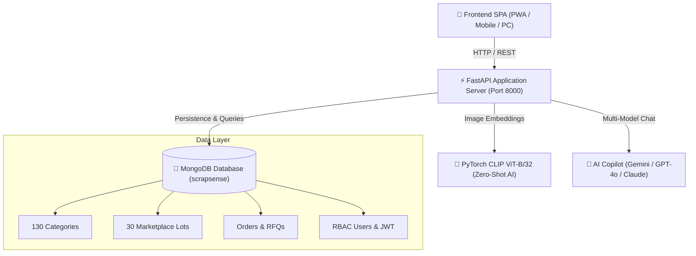

<div align="center">

# ⚙️ ScrapSense AI
### Smart Scrap & Electronic Waste Valuation · AI Vision · Mandi Pricing · Circular Marketplace

[](https://www.python.org/)
[](https://fastapi.tiangolo.com/)
[](https://pytorch.org/)
[](https://www.mongodb.com/)
[](https://huggingface.co/)
[](LICENSE)

<p align="center">
  <b>An end-to-end intelligent recycling platform that classifies scrap using Zero-Shot Computer Vision, estimates real-time Indian mandi valuation, tracks circular eco-impact, and connects verified sellers with industrial recyclers.</b>
</p>

[Explore Features](#-key-features) •
[Architecture](#-system-architecture) •
[Quick Start](#-quick-start) •
[API Documentation](#-api-endpoints) •
[Database System](#-mongodb-database--analytics)

---

</div>

## 🌟 Overview

**ScrapSense AI** solves the informal, unorganized nature of the Indian scrap and e-waste recycling industry. By combining **CLIP (Zero-Shot Visual Classification)** with dynamic **Mandi Spot Rate Engines**, ScrapSense AI empowers scrap sellers, electronics dismantlers, and industrial recyclers with transparent market pricing, eco-impact analytics, and admin-mediated procurement.

---

## 🚀 Key Features

### 👁️ 1. Zero-Shot AI Vision Classification
- Powered by OpenAI's **CLIP ViT-B/32** model.
- Classifies electronic components, microchips, PCBs, copper wiring, and bulk scrap in real time without task-specific training data.
- Fallback & hybrid integration with multi-LLM vision providers (Google Gemini 1.5, OpenAI GPT-4o, Claude 3.5 Sonnet).

### 📊 2. Dynamic Mandi Pricing Engine
- Live scrap spot rates across **9 Indian metros** (Pune, Mumbai, Delhi NCR, Bengaluru, Hyderabad, Jaipur, Ahmedabad, Chennai, Kolkata).
- Categorized across **6 major material sectors** with over **130 authentic scrap commodities**.
- Interactive quantity calculator with instant minimum, average, and maximum payout projections.

### 🏢 3. Three-Tier Role-Based Marketplace
- **📦 Scrap Sellers**: Scan components, check mandi benchmarks, and publish bulk scrap lots for sale.
- **🏢 Enterprise Buyers**: Browse verified lots, submit price offers, and broadcast custom Buy Requirements (RFQs).
- **🛡️ Administrator**: Verify lots, moderate transactions, manage users, and route scrap to certified refineries.

### 🌱 4. Circular Economy & Eco-Impact Analytics
- Computes **CO₂ emissions diverted**, **energy conserved**, and **precious metal recovery rates** for every item scanned.
- Provides actionable dismantling and upcycling tips to prevent hazardous burning and increase scrap yield.

### 📱 5. Modern Progressive Web App (PWA)
- High-performance Vanilla JavaScript & CSS single-page application (zero heavy JS framework overhead).
- Mobile-responsive scanner with instant QR code pairing, sound effects, and offline caching via Service Worker.

---

## 🏗️ System Architecture



---

## 📂 Project Structure

```
ScrapeSense-Ai/
├── backend/
│   ├── main.py              # FastAPI server (Endpoints, static mounting & middleware)
│   ├── auth.py              # JWT authentication & role-based access control
│   ├── categories.py        # 130 scrap materials catalog & dealer directory
│   ├── ai_service.py        # Multi-provider AI Copilot & Vision adapter
│   ├── seed_db.py           # Comprehensive MongoDB seeder script
│   ├── requirements.txt     # Python backend dependencies
│   └── tests/               # Backend API tests
├── frontend/
│   ├── index.html           # Main single-page application (All roles)
│   ├── script.js            # Frontend logic, state management & API client
│   ├── style.css            # Dark mode glassmorphism UI & responsive styles
│   ├── sw.js                # Service Worker (PWA offline caching)
│   └── manifest.json        # PWA configuration
├── run.py                   # Unified concurrent server launcher (Backend + Live Frontend)
├── show_database.py         # MongoDB database visual inspection CLI tool
├── allow_firewall.bat       # Windows firewall rule utility for LAN mobile access
├── start.bat                # Windows 1-click batch launcher
├── start.ps1                # PowerShell launcher
└── README.md                # Project documentation
```

---

## ⚡ Quick Start

### 1. Prerequisites
- **Python 3.10+**
- **MongoDB** (Local instance on `mongodb://127.0.0.1:27017` or MongoDB Atlas)
- **Git**

### 2. Clone and Setup Environment

```bash
# Clone the repository
git clone https://github.com/shubhamsah-18/ScrapeSense-Ai.git
cd ScrapeSense-Ai

# Create virtual environment
python -m venv .venv
.venv\Scripts\activate       # On Windows
# source .venv/bin/activate  # On Linux/macOS

# Install dependencies
pip install -r backend/requirements.txt
```

### 3. Seed Database (Optional but Recommended)
Populate the database with 130 scrap materials, 30 verified lots, and test accounts:
```bash
python backend/seed_db.py
```

### 4. Launch Application
Start the unified application with a single command:
```bash
python run.py
```
- **Unified Web App**: [http://127.0.0.1:8000](http://127.0.0.1:8000)
- **Interactive Swagger Docs**: [http://127.0.0.1:8000/docs](http://127.0.0.1:8000/docs)
- **Live Database Inspector**: `python show_database.py`

---

## 🔌 API Endpoints Summary

| Method | Endpoint | Access | Description |
|:---|:---|:---|:---|
| `GET` | `/health` | Public | System and service health check |
| `GET` | `/categories` | Public | Fetch 130 materials with city pricing |
| `GET` | `/dealers` | Public | Certified Indian recyclers directory |
| `POST` | `/predict` | Public | AI zero-shot image classification |
| `POST` | `/calculate` | Public | Instant scrap valuation calculator |
| `POST` | `/auth/login` | Public | Role-based user authentication (JWT) |
| `POST` | `/auth/request-otp` | Public | Email OTP generation for signup |
| `GET` | `/listings` | JWT | Verified marketplace scrap lots |
| `POST` | `/listings` | Seller | Publish new scrap lot for sale |
| `GET` | `/seller/listings` | Seller | Retrieve seller's managed listings |
| `POST` | `/approval-requests`| Buyer | Submit purchase offer or procurement RFQ |
| `GET` | `/admin/listings` | Admin | Review pending seller lots |
| `PATCH`| `/listings/{id}/verify`| Admin | Approve/Reject scrap listing |

---

## 🍃 MongoDB Database & Analytics

Run the built-in database inspector anytime:
```bash
python show_database.py
```

```text
==============================================================================
  [+] SCRAPSENSE AI - MONGODB DATABASE REPORT
==============================================================================
  * categories   : 130 items across 6 material sectors (Metal, E-Waste, etc.)
  * listings     : 30 seller lots (24 verified + 6 pending approval)
  * orders       : 5 transactions, admin approvals & procurement RFQs
  * users        : 14 accounts (Administrator, verified sellers & buyers)
  * dealers      : 6 CPCB-certified recycling partners
  * analytics    : 48.6T estimated CO2 emissions diverted
==============================================================================
```

---

## 👥 Roles & Access Credentials

| Role | Access Scope | Login Identifier | Password |
|:---|:---|:---|:---|
| **🛡️ Administrator** | Full platform moderation & approvals | `7488114039` | `12341234` |
| **📦 Scrap Seller** | Camera scanner, mandi board & sales | `shubhamhas21@gmail.com` | User set |
| **🏢 Enterprise Buyer**| Bulk marketplace, offers & RFQ desk | `buyer@scrapsense.org` | User set |

---

## 👨‍💻 Author

**Shubham Sah**
- **GitHub**: [@shubhamsah-18](https://github.com/shubhamsah-18)
- **Project**: Computer Science & Engineering Final Year Project

---

## 📄 License
This project is licensed under the [MIT License](LICENSE).
